# Notes Data Structures and algorithsm

# Goals

Boot_Dev

 - Learn to think algorithmically. Break problems down into easier-to-solve parts.
 - Le arn to think about how to organize data for more efficient access. Break problems down into data models that make sense.
 - Learn and practice performance optimization. Make your code run faster and more efficiently, even with more data.

Mine:

    Learn in a way I can also teach it not only work with it. This step is crucial for my understanding of any topic. I'll no longer work with mediocrity nor will I force perfection, I'm here to learn, I'm a student, even when being a teacher becomes a responsinility, I'll still be a student. 

May this be good for me.
Soli Deo Gloria(SDG)

# Data Structures & Algorithm

Data structures are organizational tools that allow for more advanced algorithms.

Examples of data structures are:
 - List
 - Dictionaries
 - Sets

One of the big questions about these is, "When should I use one or another?"

An algorithm is a set of instructions that can be carried out to solve a problem. 

**Dont focus on memorizing this algorithms or data structures. Focus on undestanding how DSA works at the moment. You should understand what your code is doing and why.**

# What is an Algorithm?

In the context of computer science, an algorithm is a finite sequence of well-defined, computer-implementable instructions. In short, an algorithm is:

- Defined: there is a specific sequence of steps that performs a task
 - Unambiguous: there is a "correct" and "incorrect" interpretation of the steps
 - Implementable: it can be executed using software and hardware

Algorithms is not "code" per se, it is usually written in pseudocode because algorithm is a higher-level description of a solution to a problem. 
So, it does not care about the language or how or where is implemented. 
Pseudocode is just plain English that describes the steps of the algorithm. 

Visual Example:

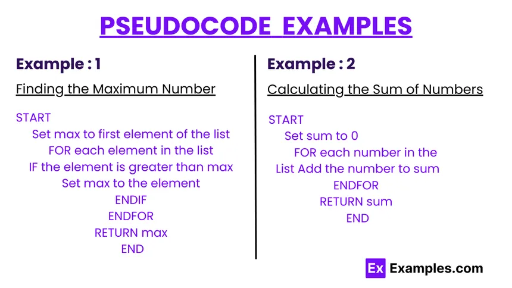 

# Chapter 2: Math

## Exponentials

Basically in Python we can use the notation ** for exponentials"

eg.
    5^2 == 5**2(in python)

### Exponents grow

Exponents grow very large veri quickly.

eg.
    10^2 = 100
    10^4 = 10,000
### Non-Linear Growth

Exponents are important to understand when it cokmes to the execution speed of an algorithm. 

If the number of operations grows quickily as the amount of the input data increases, the algorithm will become slower and slower.

eg.

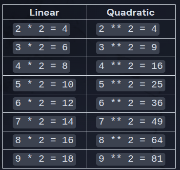

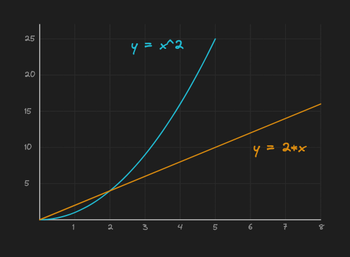

The doubling formula, 2*x results in linear or straight growth

The quadratic formula, x^2, keeps growing faster and faster.

Generally we try to avoid writing code that causes the usage of a resource to grow quadratically (with an exponent).

Sometimes that's a lot of computations (CPU utilization / slowness).
Sometimes that's a lot of memory usage (RAM utilization)
Sometimes that's a large storage requirement (disk space)
A notable exception is in cryptography and security: we want to force attackers to waste resources trying to get at our information

So we want the code to execute faster, and since we have the ability to decide that(According to how we construct our code, ergo we can also decide for a process to take a looooong time to process(like in the case of contrasting a hacker) )

## Logarithms 

A logarithm is the inverse of an oponent

eg.
    Exponent : 2^2 = 4
    Log(2)= log_2 4 = 2 || log_2 16 = 4

"log_2(16)" can be read as "log base 2 of 16", and means "the number of times 2 must be multiplied by itself to equal 16".

Brief eg. 

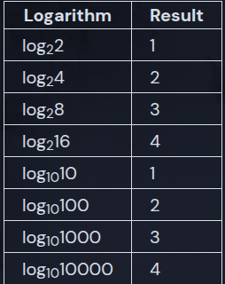

On python there is no direct operator to calculate log, but we can import the **math** library and use the math.log() function

    import math
    print(f"Logarithm base 2 of 16 is: {math.log(16, 2)}")
    # Logarithm base 2 of 16 is: 4.0
  
As opposed to exponents log grows **very very slow**.

Here is an example of the grox between a dobling formula and logarithm formula:

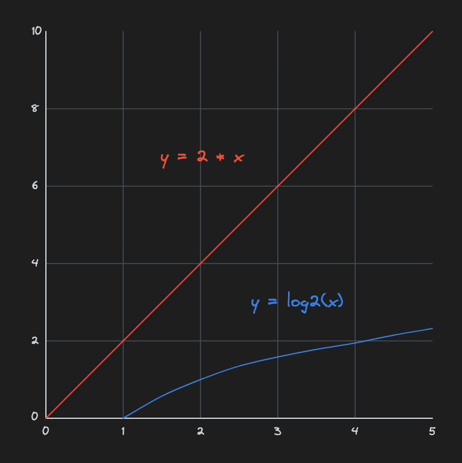

An example comparing linear, quadratic and log formulas, the differences are astronomical:

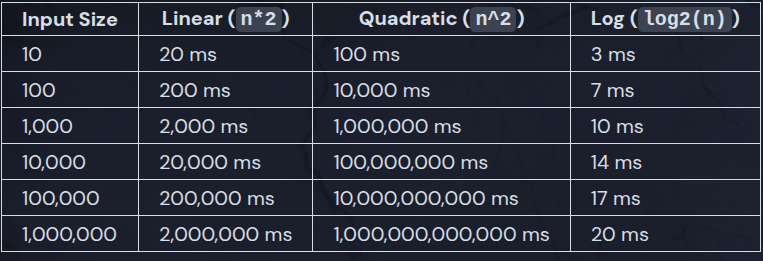

As you can see from the input colimn to the quadratic, the highest number is 10^6 or higher, when log, is just 20

## Factorials

The factorial of a positive integer os the product of all positive integer less than and equal to n not equal to 0.

eg.
    5! = 5*4*3*2*1 = 120
Factorials grows even faster than exponentiation.

Comparison table:

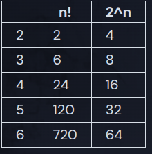

Graph comparing x!, 2^x, 2*x

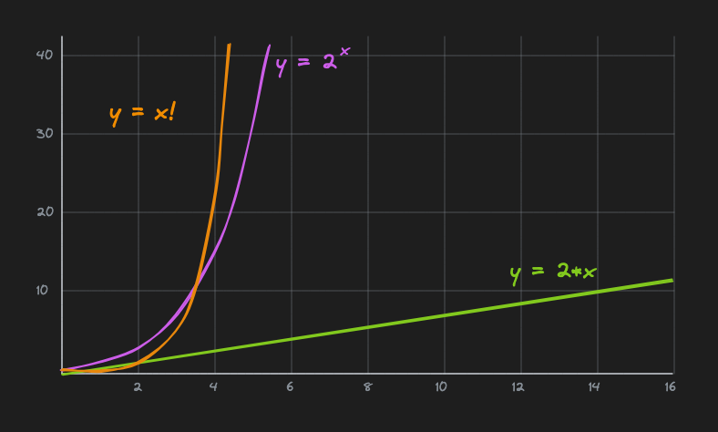

As you cann see x! at first grows slower than 2^x, but then it grows much faster

For a numerical idea:
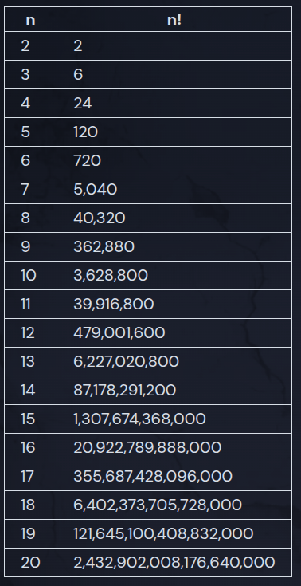

Increasing the value by 10 increased the result by 10^18

## Exponential decay

In physics an exponential decay is a process where a quantity decreases over time at a rate proportional to its current value. 

## Logarithmic Scale

In some cases, data can span several orders of magnitude, making it difficult to visualize on a linear scale. A logarithmic scale can help by compressing the data so that it's easier to understand.

For example, at LockedIn we have influencers with follower counts ranging from 1 to 1,000,000,000. If we want to plot the follower count of each influencer on a graph, it would be difficult to see the differences between the smaller follower counts. We can use a logarithmic scale to compress the data so that it's easier to visualize.

## Mean and Median

Means and medians are two of the most common ways to "summarize" a group of numbers.

The mean (or "average") of a group of numbers is the sum divided by the count of those numbers.

For example, say we have the numbers 2, 5, 1, 6, 75:

2 + 5 + 1 + 6 + 75 = 89
89 / 5 = 17.8

The mean is 17.8.

The median of a group of numbers is the middle number after sorting them.

For example, say we have the numbers 2, 5, 1, 6, 75:

Sort the numbers: 1, 2, 5, 6, 75
The middle number is 5, so the median is 5.

# Chapter 3 : Big O Notation

Pronounced "Big Oh" not "Big Zero"

Big O Analysis is oneway to compare the practicality of algorithms by classifying their time complexity. 

Big O is a characterization of algorithms according to their worst-case growth rates

We write Big-O notation like this:
        O(formula)

Where formula describes how an algorithm's run time or space requirements grow as the input size grows.

    O(1) - constant
    O(log n) - logarithmic
    O(n) - linear
    O(n^2) - squared
    O(2^n) - exponential
    O(n!) - factorial

As the size of inputs grows, the algorithms become slower to complete (take longer to run). The rate at which they become slower is defined by their Big O category.

For example, O(n) algorithms slow down more slowly than O(n^2) algorithms.

The Worst Big-O Category?
    The algorithms that slow down the fastest in our chart are the factorial and exponential algorithms, or O(n!), and O(2^n).

## O(n) - Order “n”

O(n) is very common - When the number of steps in an algorithm grows at the same rate as its input size, it's classified as O(n)

For example, our find min algorithm from earlier is O(n):

Set min to positive infinity.
For each number in the list, compare it to min. If it is smaller, set min to that number.
min is now set to the smallest number in the list.
The input to the find min algorithm is a list of size n. Because we loop over each item in the input once, we add one step to our algorithm for each item in our list.

As we use find min with larger and larger inputs, the length of time it takes to execute the function grows at a steady linear pace. We can reasonably estimate the time it will take to run, based on a previous measurement. If we find that:

Input size	Time to run
find_min(10 items)	2 ms
Then we can estimate the following:

Input size	Time to run
find_min(100 items)	20 ms
find_min(1000 items)	200 ms
find_min(10000 items)	2000 ms

## O(n^2) - Order “N Squared”

O(n^2) grows in complexity much more rapidly. That said, for small and medium input sizes, these algorithms can still be very useful.

A common reason an algorithm falls into O(n^2) is by using a nested loop, where the number of iterations of each loop is equal to the number of items in the input:

for person_one in persons:
    for person_two in persons:
        # every combination of people
        # will go on a date... twice!
        go_on_date(person_one, person_two)

## O(nm)

O(nm) is very similar to O(n^2), but instead of a single input that we care about, there are two. If n and m increase at the same rate, then O(nm) is effectively the same as O(n^2). However, if n or m increases faster or slower, then it's useful to track their complexity separately.

## Constant dont matter

Big-O notation only describes the theoretical growth rate of algorithms. It doesn't deal with the actual time an algorithm takes to run on a given machine. As such, when doing Big O analysis, we don't let ourselves get bogged down in details.

So, in Big notations, we dont care about quantitative data but qualitative one. We dont care about 3s, 5s, or 10 min. But about which is faster and which one is slower. 

Ex.
    We can tell if a ferrari is faster than a porche.
    We dont care if Ferrari is 100 mph or 10 mph faster. 

So when working with constants, we just... ignores it. 

eg.
    O(n+3) -> O(n)
    O(2log(5n)) -> O(log(n))
## O(1)

O(1) means that no matter the size of the input, there is no growth in the runtime of the algorithm. This is also referred to as a "constant time" algorithm.

In Python, a dictionary offers the ability to look items up by key, which is an operation that is independent of the size of the dictionary:

# this is a constant time lookup
org = organizations[org_id]

Dictionary lookups are O(1). Which is one of the reasons dictionaries and dictionary-equivalents in other languages are used all over the place.

## Order Log N

O(log(n)) algorithms are only slightly slower than O(1), but much faster than O(n). They do grow according to the input size, n, but only according to the log of the input.

    Coparison O(log(n)) vs O(n)
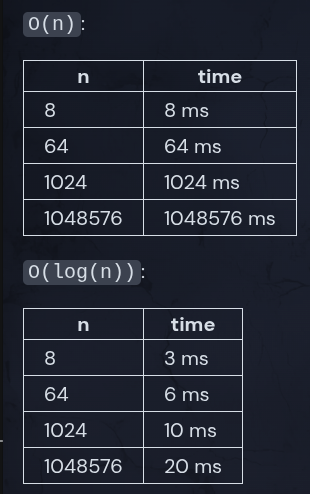

### Binary Search

A binary search algorithm is a common example of an O(log(n)) algorithm. Binary searches work on a pre-sorted list of elements.

Pseudocode
    Given two inputs:

        A list of n elements sorted from least to greatest
    A target value:

Do the following:

    Set low = 0 and high = n - 1.
    While low <= high:
        Set median (the position of the middle element) to (low + high) // 2, which is the greatest integer less than or equal to (low + high) / 2
        If list[median] == target, return True
        Else if list[median] < target, set low to median + 1
    Otherwise set high to median - 1
Return False

At each iteration of loop, we halve the list. Which makes the algorithm O(log(n)). In other words, to add one more step to the runtime, we'd have to double the size of the input. Binary searches are fast.

# Sorting Algorithms'

Almost every action you take in a web app relies on sorted data. Just looking up a user's profile in a database likely relies on a sorted index (which we'll talk about in another course).

Fortunately, most programming languages provide their own standard sorting implementation. In Python, for example, we can use the sorted function:

items = [1, 5, 3]
print(sorted(items))  # [1, 3, 5]

## Buble Sort

Bubble sort is a very basic sorting algorithm named for the way elements "bubble up" to the top of the list.

Bubble sort repeatedly steps through a slice and compares adjacent elements, swapping them if they are out of order. It continues to loop over the slice until the whole list is completely sorted. Here's the pseudocode:

Set swapping to True
Set end to the length of the input list
While swapping is True:
    Set swapping to False
    For i from the 2nd element to end:
        If the (i-1)th element of the input list is greater than the ith element:
            Swap the (i-1)th element and the ith element
            Set swapping to True
    Decrement end by one
Return the sorted list

Bubble Sort Big O
Implementation reference:

def bubble_sort(nums: list[int]) -> list[int]:
    swapping = True
    end = len(nums)
    while swapping:
        swapping = False
        for i in range(1, end):
            if nums[i - 1] > nums[i]:
                temp = nums[i - 1]
                nums[i - 1] = nums[i]
                nums[i] = temp
                swapping = True
        end -= 1
    return nums

Best and Worst Case
Sometimes it's useful to know how the algorithm will perform based on what the input data is instead of just how much data there is. In the case of bubble sort (and many other algorithms), the best and worst case scenarios can actually change the time complexity.

Best case: If the data is pre-sorted, bubble sort becomes really fast. Can you see why?
Worst case: If the data is in reverse order, bubble sort becomes really slow (but still in the same complexity class as random data). Can you see why?

Why Bubble Sort?
Bubble sort is famous for how easy it is to write and understand.

However, it's one of the slowest sorting algorithms, and as a result is almost never used in practice. That said, we covered it because it's a useful thought exercise so that you can appreciate why the more complex and performant algorithms are better. Let's cover those next.

## Merge Sort

The algorithm consists of two separate functions, merge_sort() and merge().

merge_sort() divides the input array into two halves, calls itself on each half, and then merges the two sorted halves back together in order.

The merge() function merges two already sorted lists back into a single sorted list. At the lowest level of recursion, the two "sorted" lists will each only have one element. Those single element lists will be merged into a sorted list of length two, and we can build from there.

In other words, all the "real" sorting happens in the merge() function.

merge_sort() pseudocode
Input: A, an unsorted list of integers

If the length of A is less than 2, it's already sorted so return it
Split the input array into two halves down the middle
Call merge_sort() twice, once on each half
Return the result of calling merge(sorted_left_side, sorted_right_side) on the results of the merge_sort() calls
merge() pseudocode
Inputs: A and B. Two sorted lists of integers

Create a new final list of integers.
Set i and j equal to zero. They will be used to keep track of indexes in the input lists (A and B).
Use a loop to compare the current elements of A and B:
While i < len(A) and j < len(B), compare A[i] and B[j].
Append the smaller or equal value to final.
Increment the index for the list you just took from.
Stop when either list is exhausted.
After comparing all the items, there may be some items left over in either A or B. Add those extra items to the final list.
Return the final list.

Why Merge Sort?
Pros:

Fast: Merge sort is much faster than bubble sort. O(n*log(n)) instead of O(n^2).
Stable: Merge sort is a stable sort which means that values with duplicate keys in the original list will be in the same order in the sorted list.
Cons:

Memory usage: Most sorting algorithms can be performed using a single copy of the original array. Merge sort requires extra subarrays in memory.
Recursive: Merge sort requires many recursive function calls, and in many languages (like Python), this can incur a performance penalty.

## Insertion Sort

Insertion sort builds a sorted list one item at a time. It's much less efficient on large lists than merge sort because it's O(n^2), but it's actually faster (not in Big O terms, but due to smaller constants) than merge sort on small lists.

Insertion Sort Big O
Insertion sort has a Big O of O(n^2), because that is its worst case complexity.

The outer loop of insertion sort always executes n times, while the inner loop depends on the input.

Best case: If the data is pre-sorted, insertion sort becomes really fast. Can you see why?
Average case: The average case is O(n^2) because the inner loop will execute about half of the time.
Worst case: If the data is in reverse order, it's still O(n^2) and the inner loop will execute every time.

Reference
def insertion_sort(nums: list[int]) -> list[int]:
    for i in range(len(nums)):
        j = i
        while j > 0 and nums[j - 1] > nums[j]:
            nums[j], nums[j - 1] = nums[j - 1], nums[j]
            j -= 1
    return nums

Why Use Insertion Sort?
Fast: for very small data sets (even faster than merge sort and quick sort, which we'll cover later)
Adaptive: Faster for partially sorted data sets
Stable: Does not change the relative order of elements with equal keys
In-Place: Only requires a constant amount of memory
Online: Can sort a list as it receives it
Why Is Insertion Sort Fast for Small Lists?
Many production sorting implementations use insertion sort for very small inputs under a certain threshold (very small, like 10-ish), and switch to something like quicksort for larger inputs. They use insertion sort because:

There is no recursion overhead
It has a tiny memory footprint
It's a stable sort as described above

## Quick Sort

Quick Sort
Quick sort is an efficient sorting algorithm that's widely used in production sorting implementations. Like merge sort, quick sort is a recursive divide and conquer algorithm.

Divide:

Select a pivot element that will preferably end up close to the center of the sorted pack
Move everything onto the "greater than" or "less than" side of the pivot
The pivot is now in its final position
Recursively repeat the operation on both sides of the pivot
Conquer:

The array is sorted after all elements have been through the pivot operation

Pseudocode
Select a "pivot" element - We'll arbitrarily choose the last element in the list
Move through all the elements in the list and swap them around until all the numbers less than the pivot are on the left, and the numbers greater than the pivot are on the right
Move the pivot between the two sections where it belongs
Recursively repeat for both sections

Quick Sort Big O
On average, quicksort has a Big O of O(n*log(n)). In the worst case, and assuming we don't take any steps to protect ourselves, it can degrade to O(n^2). partition() has a single for-loop that ranges from the lowest index to the highest index in the array. By itself, the partition() function is O(n). The overall complexity of quicksort is dependent on how many times partition() is called.

Worst case: The input is already sorted. An already sorted array results in the pivot being the largest or smallest element in the partition each time, meaning partition() is called a total of n times.

Best case: The pivot is the middle element of each sublist which results in log(n) calls to partition().

Reference
def quick_sort(nums: list[int], low: int, high: int) -> None:
    if low < high:
        p = partition(nums, low, high)
        quick_sort(nums, low, p - 1)
        quick_sort(nums, p + 1, high)

def partition(nums: list[int], low: int, high: int) -> int:
    pivot = nums[high]
    i = low
    for j in range(low, high):
        if nums[j] < pivot:
            nums[i], nums[j] = nums[j], nums[i]
            i += 1
    nums[i], nums[high] = nums[high], nums[i]
    return i

Fixing Quick Sort
While the version of quicksort that we implemented is almost always able to perform at speeds of O(n*log(n)), its Big O is still technically O(n^2) due to the worst-case scenario. We can fix this by altering the algorithm slightly.

Two of the approaches are:

Shuffle input randomly before sorting. This can trivially be done in O(n) time.
Actively find the median of a sample of data from the partition, this can be done in O(1) time.
Random Approach
The random approach is easier to code, which is nice if you're the one writing the code.

The function simply shuffles the list into random order before sorting it, which is an O(n) operation. The likelihood of shuffling a large list into sorted order is so low that it's not worth considering.

Median Approach
Another popular solution is to use the "median of three" approach. Three elements (for example: the first, middle, and last elements) of each partition are chosen and the median is found between them. That item is then used as the pivot.

This approach has less overhead, and also doesn't require randomness to be injected into the function, meaning it can remain deterministic and pure.

hy Use Quick Sort?
Pros:

Very fast: At least it is in the average case
In-Place: Saves on memory, doesn't need to do a lot of copying and allocating
Cons:

Typically unstable: changes the relative order of elements with equal keys
Recursive: can incur a performance penalty in some implementations
Pivot sensitivity: if the pivot is poorly chosen, it can lead to poor performance
All this said, quicksort is widely used in the real world because the trade-offs are often worth it. For example, it's a default in PostgreSQL, a popular open-source database.

I'd also like to shoutout Timsort, a hybrid of merge sort and insertion sort that was Python's default from version 2.3 to 3.10. As of Python 3.11, it's been replaced by Powersort, which makes small but meaningful improvements.

## Selection Sort
Another sorting algorithm we never covered in-depth is called "selection sort". It's similar to bubble sort in that it works by repeatedly swapping items in a list. However, it's slightly more efficient than bubble sort because it only makes one swap per iteration.

Selection sort pseudocode:

For each index:
Set smallest_idx to the current index (of the outer loop)
For each index from i + 1 to the end of the list:
If the number at the inner loop index is smaller than the number at smallest_idx, set smallest_idx to the inner loop index
Swap the number at the outer loop index with the number at smallest_idx
Return the sorted list

# Exponential Time

## Polynomial vs Exponential 
Broadly speaking, algorithms can be classified into two categories:

"Polynomial time"
"Exponential time"

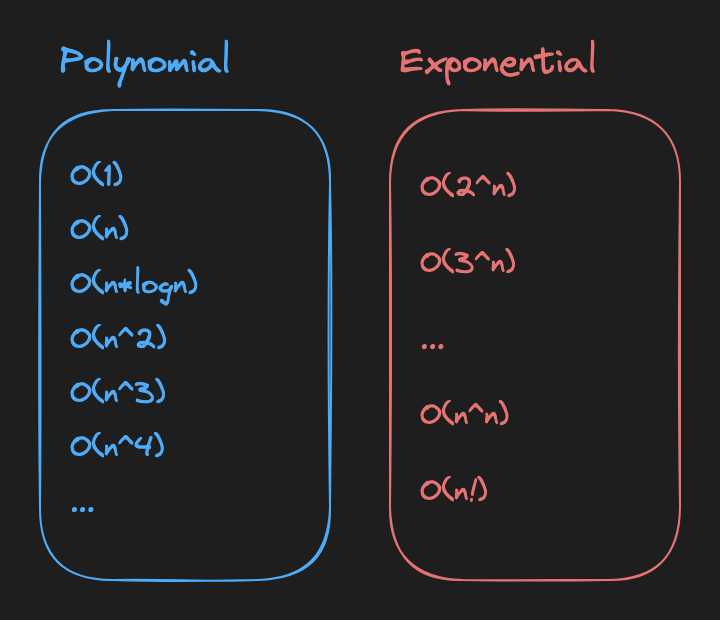

Technically O(n!) is "factorial" time, but let's lump them together for simplicity

An algorithm runs in "Polynomial time" if its runtime does not grow faster than n^k, where k is any constant (e.g. n^2, n^3, etc) and n is the size of the input. Polynomial-time algorithms can be useful if they're not too slow.

In comparison, exponential-time algorithms are almost always too slow to be practical. (However, sometimes you're trying to force someone to be slow, like in the case of cryptography and security). Even when n is as low as 20, 2^n is already over a million!

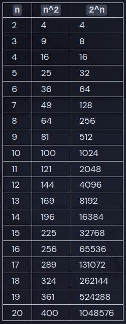

## Polynomial Time = P
Back in the 1970s, some computer scientists wanted to come up with a good, descriptive name for the set of polynomial time algorithms. After much deliberation, they settled on the letter P (naming things is hard).

The hand-wavy takeaway is that:

Problems that fall into class P are practical to solve on computers.
Problems that don't fall into P are hard, slow, and impractical.

We can "reduce"  not class P into a class P and viceversa.

## Order K^N – Exponential

O(K^N) – where K represents a constant branching factor, e.g. 3^N – is the first Big O class that we've dealt with that falls into the scary exponential category of algorithms.

Algorithms that grow at an exponential rate become impossible to compute after so little scale-up that they're usually almost worthless in practicality.

## Big O Categories Review

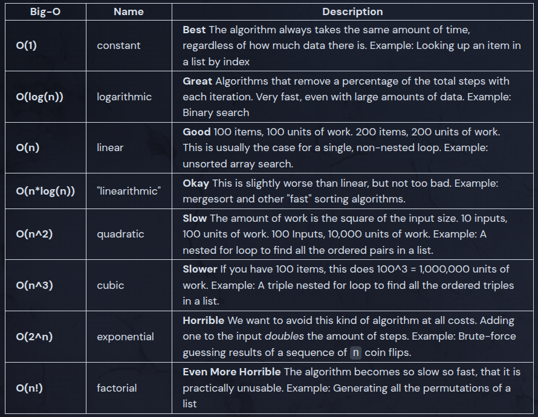
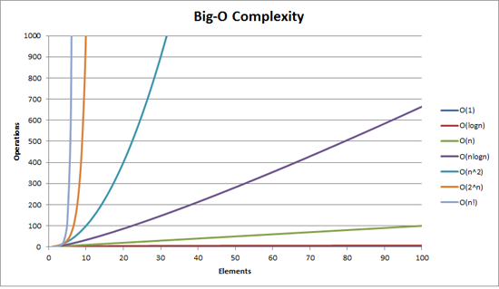

# Data structures Intro

## Introduction

Starting with this chapter, we're going to focus on how we can store and organize data in a way that allows for even better algorithms.

Data structures are just organizational tools that allow for more advanced algorithms. Some examples:

Stacks: Last in, first out.
Queues: First in, first out.
Linked Lists: A chain of nodes, efficient for inserts and deletes.
Binary Trees: A tree where each node has up to two children.
Red Black Trees: A self-balancing binary tree using colors.
Hashmaps: A data structure that maps keys to values.
Tries: A tree used for storing and searching words efficiently.
Graphs: A collection of nodes connected by edges.

## What Are Data Structures?

A data structure is a data organization, management, and storage format that enables efficient access and modification. More precisely, a data structure is a collection of data values, the relationships among them, and the functions or operations that can be applied to the data.

-- Wikipedia Definition

In other words, a data structure:

Stores data
Organizes data so that it can easily be accessed and modified
Contains algorithmic functions to expose the ability to read and modify the data
You're already familiar with some of Python's built-in, simple data structures:

List: An ordered collection of items

animals = ["cat", "dog", "mouse"]

Dictionary: Collections of key/value pairs

car = {"brand": "Ford", "model": "Mustang", "year": 1964}

## Lists

Okay, we know what lists are, but from a data structures and algorithms perspective, what are they good for? Let's break it down by operation:

Append: Appending an element to the end of a list, e.g. cars.append("ford") is (on average) O(1). We go directly to the end and add the element.
Index: Accessing an element by index, e.g. cars[2] is O(1). We go directly to the index and return the element.
Delete: Removing an element from the middle of a list, e.g. cars.pop(2) is O(n). We have to shift all the elements after the deleted element down one index.
Search: Searching for an element in a list, e.g. cars.index("ford") is O(n). We have to iterate over the list until we find the element.
In other words, lists start to struggle in two primary areas:

When you need to frequently delete elements from the middle of the list
When you need to frequently search for specific elements in the entire list

# Stacks

A stack is a data structure that stores ordered items. It's like a list, but its design is more restrictive. It only allows items to be added or removed from the top of the stack(imagine a tower made of pancakes, if you were to add or to eat one, it will always be from the top):

It's called a "stack" because it behaves just like a stack of physical items. Imagine a stack of plates: it's easy to take an item off the top of the stack, but you can't really get to the items in the middle or at the bottom without removing the items on top first. You'll often hear a stack referred to as a LIFO (last in, first out) data structure.

Whoever decided to take this simple concept and slap a nasty acronym on it should be forced to program in Prolog for the rest of their days.

## Stack Speed
You might be wondering, "why would I use a stack instead of a list?" or "Isn't this just a list with fewer features?"

And you'd be right! A stack is a list with fewer features, but that's the point. By restricting the ways we can interact with the data, we guarantee that certain operations are blazingly fast. Here are all the operations a typical stack supports, along with their Big O time complexity:

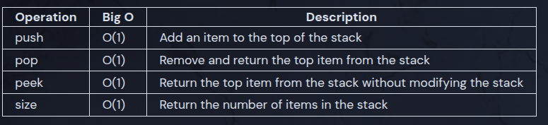

It's all O(1)! That means no matter how many items are in the stack, these operations will always take the same amount of time. Stacks are really fast and are usually the best choice when the behavior of a stack is all you need.

## Eg. code

from typing import Any

class Stack:
    def __init__(self) -> None:
        self.items: list[Any] = []

    def push(self, item: Any) -> None:
        self.items.append(item)

    def size(self) -> int:
        return len(self.items)

    def peek(self) -> Any:
        if self.size() == 0:
            return None
        return self.items[-1]

    def pop(self) -> Any:
        if self.size() == 0:
            return None
        return self.items.pop()
